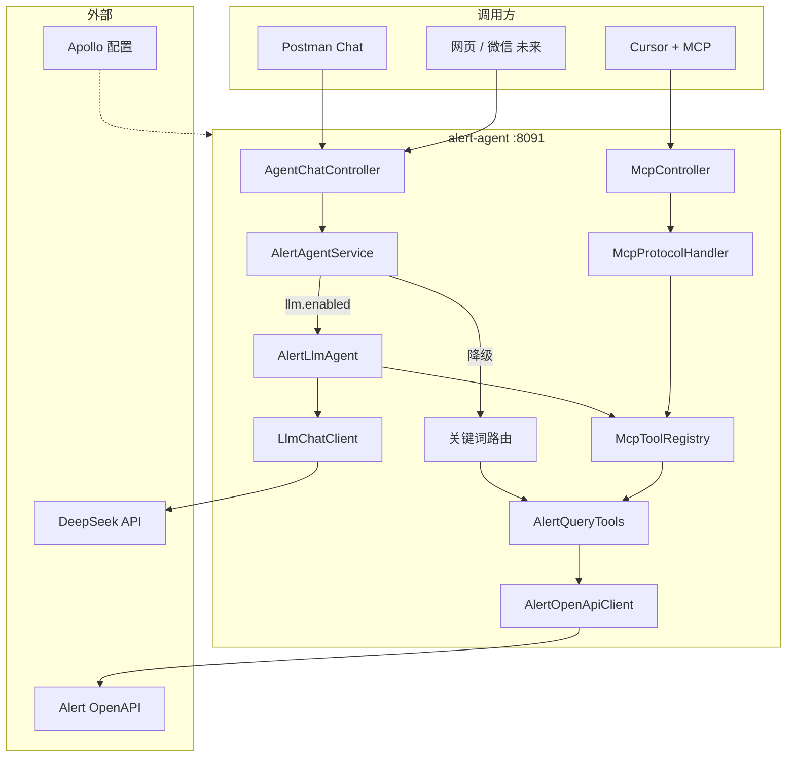

# 告警智能研判 Agent（alert-agent）学习笔记

> 项目：`uyun.eagle.agent:alert-agent`  
> 测试环境示例：`http://10.1.53.34:8091`  
> 目标：独立微服务，通过 Alert OpenAPI 做只读告警查询 + Agent 对话 + MCP + LLM 研判（Phase 1 / 1b）

---

## 一、项目是怎么搭起来的

### 1.1 脚手架

| 项 | 值 |
|----|-----|
| 脚手架 | `uyun.archetype:archetype-single:1.4.5` |
| artifactId | `alert-agent` |
| groupId | `uyun.eagle.agent` |
| appCode | `AlertAgent` |
| contextPath | `/alertagent` |
| HTTP 端口 | 8090（测试 Apollo 常改为 **8091**） |
| Dubbo 端口 | 20890 |

脚手架自带：Spring Boot + JPA + Flyway + Dubbo + Security + 示例 Todo 模块。**Agent 功能是在脚手架之上增量开发的**，没有改 alert-server。

### 1.2 开发约束

- **不能本地启动**，打包部署到测试环境验证
- **不修改 alert-server**，只 HTTP 调 Alert OpenAPI
- Phase 1 全程 **只读**，不写 Alert 数据

---

## 二、如何成功启动（踩坑最多的一段）

### 2.1 启动必备配置（Apollo）

| 配置项 | 说明 |
|--------|------|
| MySQL | 库名 `alertagent`，账号密码 |
| `biz.enable` | `true`（产品注册） |
| `biz.app.description` | **必须是 list**（英文 + 中文各一条），否则 `TenantException` |
| `alert.openapi.baseurl` | `http://10.1.53.32:7508/alert/openapi`（**不要带 `/v2`**） |
| `alert.openapi.apikey` | 与 evolutionps 等共用的 OpenAPI key |
| `server.port` | 8091（8090 冲突时改） |
| `spring.main.allow-bean-definition-overriding` | 放 base.yml，Apollo 里可删 |

`biz.app.description` 正确写法示例：

```yaml
biz:
  app:
    description:
      - alertagent app
      - 告警智能研判Agent
```

### 2.2 启动成功标志

- OMP 健康检查 **UP**
- 日志里有 **register product** 且无 `TenantException`
- `GET /actuator/health` 返回 UP

---

## 三、Phase 1：我们写了什么、测了什么

### 3.1 核心代码结构（Phase 1）

```
alertagent/
├── config/AlertProperties.java      # Alert OpenAPI 配置
├── client/AlertOpenApiClient.java   # HTTP 调 Alert（query / detail）
├── tool/
│   ├── AlertQueryTools.java         # 4 个只读 Tool（业务核心）
│   └── dto/AlertBrief, AlertCount
├── agent/
│   ├── AgentChatController.java     # POST /agent/chat
│   ├── AlertAgentService.java       # 关键词路由 + LLM 双模式
│   ├── AlertAgentPrompts.java       # System Prompt / 帮助文案
│   └── dto/AgentChatRequest/Response
└── mcp/                             # Phase 1 MCP（见第四节）
```

**设计原则：Tool 一套、多入口复用。**

### 3.2 四个只读 Tool

| Tool | 方法 | Alert OpenAPI |
|------|------|---------------|
| 今天告警数 | `countTodayAlerts` | `GET /v2/incident/query`（当天 begin/end + total） |
| 告警列表 | `queryAlerts` | 同上（默认未关闭、本地按时间倒序） |
| 告警详情 | `getAlertDetail` | `GET /v2/incident/getIncidentById` |
| 相似告警 | `findSimilarAlerts` | 先 detail 再 query（entityName + name） |

### 3.3 Phase 1 测试用例（Postman Chat API）

**统一入口：**

```
POST http://10.1.53.34:8091/alertagent/frontapi/v1/agent/chat
Content-Type: application/json
```

| # | Body | 验证点 |
|---|------|--------|
| 测试 1 | `{"message":"查询最近的告警列表","sessionId":"test-002"}` | 列表、`intent=list` |
| 测试 2 | `{"message":"今天有多少告警","sessionId":"test-001"}` | 数量、`intent=count` |
| 测试 3 | `{"message":"查看告警详情 000580969ed2470d9e25f9912c772a06","sessionId":"test-003"}` | 详情、`intent=detail` |
| 测试 4 | `{"message":"查找与 5c77b0adc79f31cee095b3be 相似的告警","sessionId":"test-004"}` | 相似、`intent=similar` |

**扩展用例：**

```json
{ "message": "查 test02 的告警", "entityName": "test02" }
```

白名单路径：`/alertagent/frontapi/v1/agent/**`（测试期免登录）。

---

## 四、MCP：怎么接 Cursor

### 4.1 新增代码（Phase 1 MCP）

```
mcp/
├── McpProperties.java       # alert.mcp.enabled
├── McpToolRegistry.java     # 4 个 Tool 的 schema + 执行
├── McpProtocolHandler.java  # JSON-RPC：initialize / tools/list / tools/call
└── McpController.java       # POST /alertagent/mcp
```

MCP 不重复写业务，只做协议适配；Tool 执行仍走 `McpToolRegistry` → `AlertQueryTools`。

### 4.2 Postman 测 MCP

**tools/list：**

```json
POST http://10.1.53.34:8091/alertagent/mcp
Content-Type: application/json

{ "jsonrpc": "2.0", "id": 1, "method": "tools/list" }
```

**tools/call（示例）：**

```json
{
  "jsonrpc": "2.0",
  "id": 2,
  "method": "tools/call",
  "params": {
    "name": "query_alerts",
    "arguments": { "entityName": "test02", "pageSize": 20 }
  }
}
```

白名单：`/alertagent/mcp`、`/alertagent/mcp/**`（Apollo `ineffectiveness-path`）。

⚠️ **不能用浏览器地址栏打开 `/alertagent/mcp`**：浏览器发 GET，MCP 只接受 POST，会 403。

### 4.3 Cursor 配置

文件：`C:\Users\<用户>\.cursor\mcp.json` 或项目 `.cursor/mcp.json`

```json
{
  "mcpServers": {
    "alert-agent": {
      "url": "http://10.1.53.34:8091/alertagent/mcp"
    }
  }
}
```

Settings → Tools → 确认 `alert-agent` Connected，能看到 4 个 tool。不用时在 Cursor 里 **关开关（Disabled）**，避免误调。

若出现 **Needs authentication / Waiting for callback**：Cursor 可能在等 OAuth，而当前 MCP 实现无 OAuth；检查 `mcp.json` 是否只有 `url`、无 oauth 字段；仍不行则先用 Postman MCP 或 Chat API。

### 4.4 三条入口对比

| 入口 | 谁理解意图 | 谁调 Tool |
|------|------------|-----------|
| Postman Chat | 关键词路由 或 LLM | AlertQueryTools |
| Cursor MCP | Cursor 里的模型 | MCP → AlertQueryTools |
| Postman MCP | 手动 tools/call | AlertQueryTools |

---

## 五、Phase 1b：LLM（DeepSeek API）

### 5.1 新增代码

```
config/LlmProperties.java     # llm.*
llm/LlmChatClient.java        # OpenAI 兼容 /chat/completions
agent/AlertLlmAgent.java      # LLM + Tool Calling 编排
```

`AlertAgentService` 双模式：

- `llm.enabled=true` → `AlertLlmAgent`（DeepSeek 选 Tool + 润色/研判）
- `false` 或 LLM 失败 → 降级关键词路由（Phase 1）

Tool 定义与执行 **复用 `McpToolRegistry`**，Chat / MCP / LLM 共用一套。

### 5.2 Apollo 配置（注意 key 名）

| Apollo 变量名 | 示例 |
|---------------|------|
| `llm.enabled` | `true` |
| `llm.baseurl` | `https://api.deepseek.com/v1` |
| `llm.apikey` | `sk-xxxxxx` |
| `llm.model` | `deepseek-chat` |

⚠️ Apollo 里是 `llm.baseurl` / `llm.apikey`，**不是** yml 里的 `base-url` / `api-key`。  
服务器需能访问 DeepSeek API（或改用公司内网模型网关地址）。

### 5.3 Phase 1b 测试

```json
POST http://10.1.53.34:8091/alertagent/frontapi/v1/agent/chat
Content-Type: application/json

{
  "message": "帮我看看 test02 最近有没有磁盘类告警，可能什么原因？",
  "sessionId": "llm-001"
}
```

成功时 `intent` 为 **`llm`**。  
**DeepSeek 官网网页不能直接查 Alert**；是 alert-agent 后端调 API。

### 5.4 编译注意

`AlertLlmAgent.java` 需 import：

```java
import uyun.eagle.agent.alertagent.agent.dto.AgentChatResponse;
```

---

## 六、踩坑与解决方案汇总

| # | 现象 | 原因 | 解决 |
|---|------|------|------|
| 1 | 启动失败 RestTemplate 冲突 | 手动 @Bean 与 own-consumer 冲突 | 删 StartApplication 里 RestTemplate，用平台 bean |
| 2 | `TenantException: description 不能为空` | `biz.app.description` 须为 **list** | Apollo 配两条 description |
| 3 | OpenAPI 404 `/v2/v2/incident/query` | base-url 多写了 `/v2` | 改为 `.../alert/openapi` |
| 4 | OpenAPI 401 | apikey 错误 | 用 evolutionps 同款 key |
| 5 | OpenAPI 400 begin 类型错误 | begin/end 须 Long 毫秒 | Tool 里转时间戳 |
| 6 | 详情 404 | 路径少了 `/v2` | 改为 `/v2/incident/getIncidentById`，从 `data` 取对象 |
| 7 | 列表与 UI 不完全一致 | OpenAPI 无 lastOccurTime 排序 | 接受差异；改 alert-server 才根治 |
| 8 | MCP 403 Forbidden | 白名单未配 MCP 路径 | Apollo 加 `/alertagent/mcp/**` 并重启 |
| 9 | 端口冲突 | 8090 占用 | Apollo `server.port=8091` |
| 10 | LLM 编译失败 | 缺 AgentChatResponse import | 补 import |
| 11 | 浏览器打开 /mcp 403 | GET 非 POST | 用 Postman POST，勿用浏览器 |
| 12 | Cursor Needs authentication | OAuth 与实现不匹配 | 简化 mcp.json；或暂用 Postman/Chat |

---

## 七、整体架构与代码逻辑

### 7.1 架构图



### 7.2 分层职责

| 层 | 包/类 | 职责 |
|----|--------|------|
| 入口 | `AgentChatController`、`McpController` | HTTP，鉴权白名单 |
| 编排 | `AlertAgentService`、`AlertLlmAgent` | 意图 → Tool → 回复 |
| 协议 | `McpProtocolHandler`、`McpToolRegistry` | MCP JSON-RPC + Tool 注册 |
| 业务 Tool | `AlertQueryTools` | 4 个只读查询（唯一业务核心） |
| 集成 | `AlertOpenApiClient`、`LlmChatClient` | 调 Alert / DeepSeek |
| 配置 | `AlertProperties`、`LlmProperties`、`McpProperties` | Apollo 绑定 |

### 7.3 Chat 一次请求的流程

```
POST /agent/chat { message }
    │
    ├─ llm.enabled=true ──► AlertLlmAgent
    │       ├─ DeepSeek(system + tools 定义 + user)
    │       ├─ tool_calls? ──► McpToolRegistry.callTool ──► AlertQueryTools
    │       ├─ 结果回填，最多 5 轮
    │       └─ 自然语言 reply，intent=llm
    │
    └─ 否则 / LLM 异常 ──► keywordChat
            ├─ 关键词识别 intent
            ├─ AlertQueryTools
            └─ 模板 reply，intent=count/list/detail/similar
```

### 7.4 MCP 一次 tools/call 的流程

```
POST /alertagent/mcp  { method: tools/call, params: { name, arguments } }
    └─ McpProtocolHandler
        └─ McpToolRegistry.callTool(name, args)
            └─ AlertQueryTools → AlertOpenApiClient → Alert OpenAPI
                └─ JSON 文本放入 MCP content 返回
```

---

## 八、「更智能」要不要训练？要不要文档？

**不是传统意义上的「训练模型」。** 当前是 **Tool Calling + Prompt**，不是微调 DeepSeek。

| 方向 | 做什么 |
|------|--------|
| **Prompt 优化** | 改 `AlertAgentPrompts.SYSTEM_PROMPT` |
| **RAG / 知识库** | 运维手册、告警 SOP、产品文档向量化 |
| **多轮会话** | `sessionId` 存历史（当前基本单轮） |
| **微调/训练** | 成本高，一般不做 |

给运维文档有用，但是 **RAG 或写进 System Prompt**，不是「训练」。

---

## 九、阶段成果清单

- [x] 脚手架独立微服务 alert-agent 部署运行
- [x] Alert OpenAPI 只读查询（4 类能力）
- [x] Postman Chat 4 个 Phase 1 用例通过
- [x] MCP Server + Cursor 自然语言查告警（Postman MCP 可测）
- [x] Phase 1b LLM（DeepSeek API）+ Tool Calling + 降级
- [x] Apollo 配置体系（alert / mcp / llm）

---

## 十、后续可选路线

1. **Prompt + 运维文档 RAG** → 研判更专业
2. **简单 H5 聊天页** → 浏览器里用 Chat，不用 Postman
3. **Phase 2 写操作** → 接手/关闭（需二次确认）
4. **微信/企业微信** → 调 Chat HTTP，不走 MCP
5. **生产安全** → MCP/Chat 收紧白名单，apikey 鉴权
6. **Cursor MCP OAuth 兼容** → 若需稳定 Cursor 远程 MCP

---

## 十一、常用地址速查

| 用途 | 方法 | 地址 |
|------|------|------|
| 健康检查 | GET | `http://10.1.53.34:8091/actuator/health` |
| Agent 对话 | POST | `http://10.1.53.34:8091/alertagent/frontapi/v1/agent/chat` |
| MCP | POST | `http://10.1.53.34:8091/alertagent/mcp` |
| Alert OpenAPI 基路径 | GET | `http://10.1.53.32:7508/alert/openapi/v2/incident/query?apikey=...` |

---

*文档版本：Phase 1 + 1b 完成时整理*
